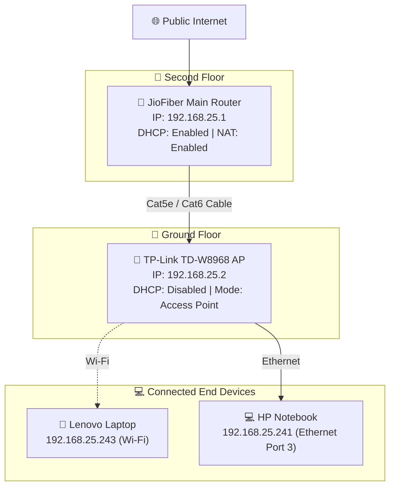

<div class="badge-group">
  <span class="badge badge-blue">Networking</span>
  <span class="badge badge-purple">JioFiber</span>
  <span class="badge badge-green">Access Point</span>
  <span class="badge badge-orange">Troubleshooting</span>
</div>

# How I Configured a TP-Link TD-W8968 as an Access Point for JioFiber

I recently started working on practical networking projects to improve Wi-Fi coverage across my home.

My JioFiber router is located on the second floor, but I needed reliable Wi-Fi and Ethernet connectivity on the ground floor. Instead of buying a new access point, I decided to repurpose an older **TP-Link TD-W8968 ADSL modem-router** that I already owned.

<div class="callout callout-info">
  <div class="callout-title">🎯 Project Goal</div>
  <p>Use JioFiber as the main internet gateway/router and configure the TP-Link strictly as a wireless access point and Ethernet switch on the same unified subnet.</p>
</div>

Although the goal sounded straightforward, setting it up required about four hours of troubleshooting. I encountered IP-address conflicts, an unreachable router administration page, a blank default gateway, automatic private link-local addresses (`169.252.x.x`), DHCP conflicts, and port behavior issues.

This article documents the complete setup, key concepts learned, and the final verified configuration.

---

## Network Equipment Used

<div class="card-grid">
  <div class="card">
    <div class="card-title">🌐 Main Gateway</div>
    <p>JioFiber router providing primary Internet connection, DHCP, and NAT.</p>
  </div>
  <div class="card">
    <div class="card-title">📻 Access Point</div>
    <p>TP-Link TD-W8968 modem-router (repurposed for AP mode).</p>
  </div>
  <div class="card">
    <div class="card-title">💻 Test Clients</div>
    <p>HP notebook (Ethernet testing) & Lenovo laptop (Wi-Fi testing).</p>
  </div>
</div>

- **Primary Router:** JioFiber router & Internet connection
- **Access Point:** TP-Link TD-W8968 modem-router
- **Wired Test Device:** HP notebook connected via Ethernet
- **Wireless Test Device:** Lenovo laptop connected via Wi-Fi
- **Cabling:** Short Ethernet cables for lab testing & long Cat5e/Cat6 cable for permanent floor-to-floor deployment

---

## The Target Network Topology

The objective was to merge both devices onto a single unified `192.168.25.x` network:



<div class="topology-container">
  <div class="topology-node">
    <div class="node-icon">🌐</div>
    <div class="node-details">
      <div class="node-title">Public Internet</div>
      <div class="node-subtitle">ISP Fiber Connection</div>
    </div>
  </div>

  <div class="topology-arrow">↓ Fiber WAN Link</div>

  <div class="topology-node">
    <div class="node-icon">📡</div>
    <div class="node-details">
      <div class="node-title">JioFiber Router (Main Gateway)</div>
      <div class="node-ip">192.168.25.1</div>
      <div class="node-subtitle">DHCP: Enabled | NAT: Enabled</div>
    </div>
  </div>

  <div class="topology-arrow">↓ Ethernet Cable (LAN to LAN)</div>

  <div class="topology-node">
    <div class="node-icon">📶</div>
    <div class="node-details">
      <div class="node-title">TP-Link TD-W8968 (Access Point)</div>
      <div class="node-ip">192.168.25.2</div>
      <div class="node-subtitle">DHCP: Disabled | Switch & AP Mode</div>
    </div>
  </div>

  <div class="topology-branches">
    <div class="topology-branch">
      <div class="topology-arrow">↙ Wi-Fi</div>
      <div class="topology-node">
        <div class="node-icon">📱</div>
        <div class="node-details">
          <div class="node-title">Lenovo Laptop</div>
          <div class="node-ip">192.168.25.243</div>
          <div class="node-subtitle">Wireless Client</div>
        </div>
      </div>
    </div>

    <div class="topology-branch">
      <div class="topology-arrow">↘ Ethernet</div>
      <div class="topology-node">
        <div class="node-icon">💻</div>
        <div class="node-details">
          <div class="node-title">HP Notebook</div>
          <div class="node-ip">192.168.25.241</div>
          <div class="node-subtitle">LAN Port 3 Client</div>
        </div>
      </div>
    </div>
  </div>
</div>

### Role Distribution

| Feature | JioFiber Router | TP-Link TD-W8968 |
| :--- | :--- | :--- |
| **IP Address** | `192.168.25.1` | `192.168.25.2` |
| **DHCP Server** | **Enabled** (Assigns IPs) | **Disabled** |
| **NAT & Routing** | **Enabled** | **Disabled** |
| **Functions** | Internet Gateway, DNS | Wi-Fi Extension, LAN Switch |

---

## Understanding the Original Problem

Initially, both routers were operating independently with conflicting settings:

```text
JioFiber Network:  192.168.25.0/24 (Router IP: 192.168.25.1)
TP-Link Network:   192.168.1.0/24  (Router IP: 192.168.1.1)
TP-Link DHCP:      Enabled (192.168.1.100 - 192.168.1.200)
```

Because the TP-Link had DHCP and routing enabled, clients connecting to the TP-Link were placed on a separate private subnet (`192.168.1.x`) behind double NAT.

<div class="callout callout-warning">
  <div class="callout-title">⚠️ What is Double NAT?</div>
  <p>Double NAT occurs when network traffic passes through two separate routers performing Network Address Translation. While basic web browsing may work, Double NAT causes major issues with online gaming, port forwarding, remote access, CCTV systems, device discovery (Chromecast/AirPlay), and local file sharing.</p>
</div>

To fix this, only the primary **JioFiber router** should perform NAT and assign IP addresses.

---

## Step-by-Step Access Point Configuration

### Step 1: Confirming the Primary JioFiber Network

Connecting a client directly to the JioFiber Wi-Fi and running `ipconfig` in Command Prompt verified the main network details:

```cmd
ipconfig
```

**Output:**
```text
IPv4 Address. . . . . . . . . . . : 192.168.25.243
Subnet Mask . . . . . . . . . . . : 255.255.255.0
Default Gateway . . . . . . . . . : 192.168.25.1
```

<div class="callout callout-warning">
  <div class="callout-title">🔒 Privacy Best Practice</div>
  <p>Always mask sensitive network details such as public IPv6 addresses, MAC addresses, default passwords, and account IDs when sharing configuration notes publicly.</p>
</div>

---

### Step 2: Accessing the TP-Link Admin Interface

Before connecting the TP-Link to JioFiber, I connected directly to the TP-Link Wi-Fi and navigated to its default management address:

`http://192.168.1.1`

Log in using the admin credentials to open the configuration dashboard.

---

### Step 3: Changing the Management IP Address

To place the TP-Link management interface on the same network subnet as JioFiber:

1. Go to **Advanced Setup > LAN**.
2. Change the **IP Address** from `192.168.1.1` to `192.168.25.2`.
3. Keep the **Subnet Mask** as `255.255.255.0`.

<div class="callout callout-tip">
  <div class="callout-title">💡 Why 192.168.25.2?</div>
  <p>Assigning a fixed, unused IP address on the primary subnet ensures you can always access the TP-Link administration dashboard in the future via <code>http://192.168.25.2</code> without network conflicts.</p>
</div>

---

### Step 4: Disabling the TP-Link DHCP Server

On the same **LAN Settings** page:

1. Select **Disable DHCP Server**.
2. Click **Save/Apply**.

<div class="callout callout-warning">
  <div class="callout-title">🚨 Critical Step</div>
  <p>Disabling DHCP on the TP-Link prevents address conflicts. There must be only <strong>ONE active DHCP server</strong> (the JioFiber router) on the local network.</p>
</div>

*Note: Immediately after saving, `http://192.168.1.1` will stop responding because the router is now accessible at its new address: `http://192.168.25.2`.*

---

### Step 5: LAN-to-LAN Physical Connection

Connect an Ethernet cable between a **LAN port on the JioFiber router** and a **LAN port on the TP-Link TD-W8968**.

<div class="callout callout-info">
  <div class="callout-title">📌 Cable Rule</div>
  <p>Do <strong>NOT</strong> use the TP-Link DSL telephone port or WAN service. This setup requires a standard <strong>LAN-to-LAN</strong> connection so the TP-Link operates strictly as a layer-2 switch and wireless access point.</p>
</div>

---

## Troubleshooting & Issues Overcome

### 1. Automatic Link-Local Address (`169.252.x.x`)

During testing, the HP notebook initially showed an APIPA address:

```text
IPv4 Address:    169.252.145.85
Default Gateway: Blank
```

**Root Cause:** The client interface detected a physical link, but could not obtain an IP address from JioFiber's DHCP server.

**Resolution:**
1. Verified that the uplink cable was securely inserted into a valid LAN port.
2. Switched the client from TP-Link LAN Port 4 to **LAN Port 3**.
3. Renewed the IP configuration:
   ```cmd
   ipconfig /release
   ipconfig /renew
   ```
4. The client successfully received `192.168.25.241` with gateway `192.168.25.1`.

---

### 2. Admin Page Unreachable After IP Change

After changing the router IP to `192.168.25.2`, trying to load `192.168.1.1` produced a connection error.

**Resolution:** This is completely normal behavior. Once the subnet changes, access the admin web interface using the new IP: `http://192.168.25.2`.

---

## Final Verified Network State

<div class="callout callout-success">
  <div class="callout-title">✅ Verified Configuration Summary</div>
  <ul>
    <li><strong>JioFiber Router:</strong> IP <code>192.168.25.1</code> | DHCP Enabled | NAT Enabled</li>
    <li><strong>TP-Link TD-W8968:</strong> IP <code>192.168.25.2</code> | DHCP Disabled | AP Mode Active</li>
    <li><strong>HP Notebook (Wired):</strong> IP <code>192.168.25.241</code> | Gateway <code>192.168.25.1</code></li>
    <li><strong>Lenovo Laptop (Wi-Fi):</strong> IP <code>192.168.25.243</code> | Gateway <code>192.168.25.1</code></li>
  </ul>
</div>

---

## Quick Reference Commands

| Task | Windows Command |
| :--- | :--- |
| View current IP & Gateway | `ipconfig` |
| View detailed network adapters | `ipconfig /all` |
| Release DHCP lease | `ipconfig /release` |
| Renew DHCP lease | `ipconfig /renew` |
| Test JioFiber gateway connectivity | `ping 192.168.25.1` |
| Test TP-Link AP connectivity | `ping 192.168.25.2` |

---

## Lessons Learned

1. **Working Internet ≠ Proper Configuration:** Devices behind double NAT might browse the web, but local networking features will break.
2. **One DHCP Server Rule:** Multiple active DHCP servers on the same L2 segment cause unpredictable IP assignments.
3. **Gateway IP as Diagnostic Key:** Checking the default gateway (`192.168.25.1`) verifies which router is directing traffic.
4. **Physical Port Testing Matters:** Hardware ports or cables can behave inconsistently; testing individual ports resolves unexpected connectivity issues.

---

## Conclusion

By converting the TP-Link TD-W8968 modem-router into a dedicated wireless access point and Ethernet switch, ground-floor Wi-Fi coverage was greatly improved without buying additional hardware. All home devices now reside on a single, seamless `192.168.25.x` network managed by JioFiber.
